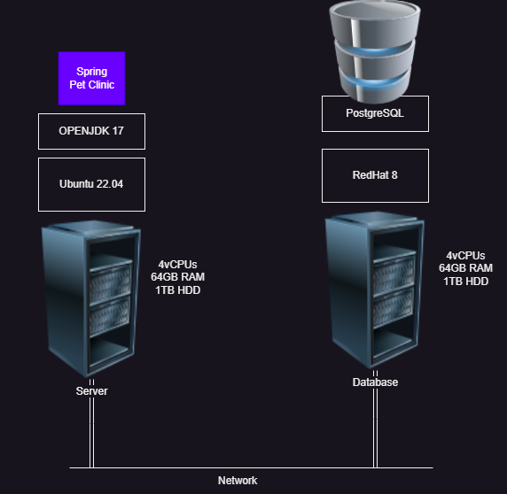
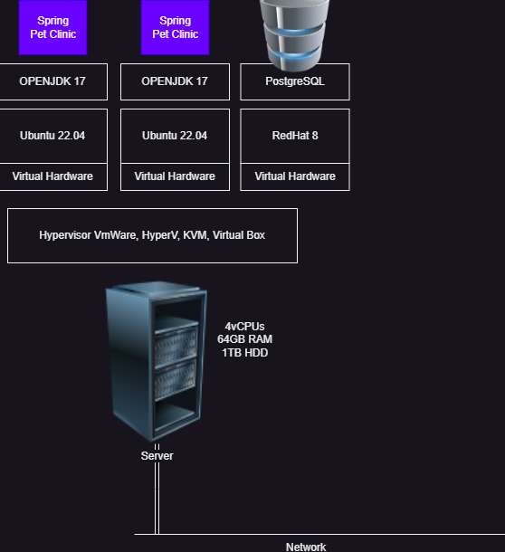
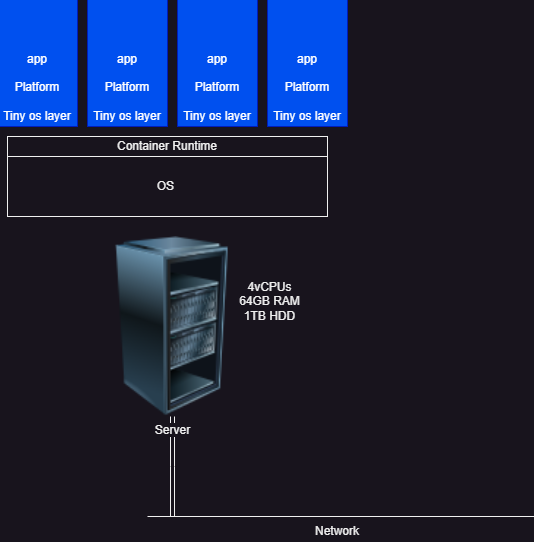
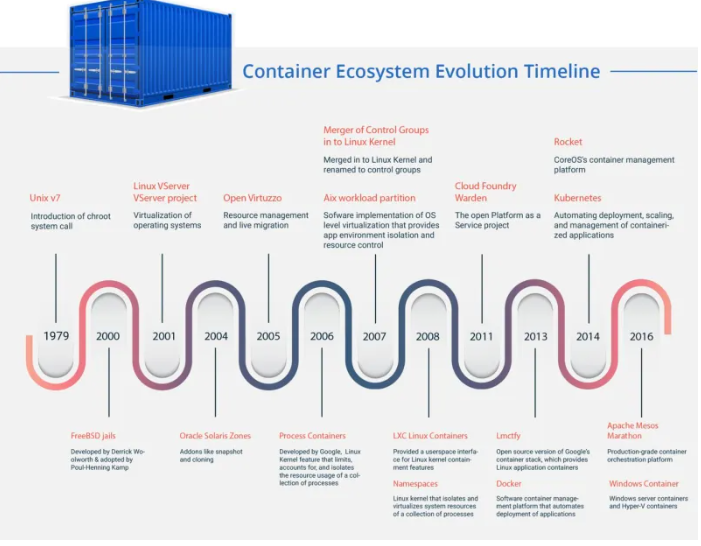

## Advanced Docker:
# Monolith
* In this category application is developed
     * to run on a single server
     * in single code base
     * in single technology
* Architecture:

* Problems
     * Deployment:
         * To make the smallest possible change on business logic server, we need to take the application down and then deploy
* Advantages:
   * Simple to configure
   * Simple to deploy
* Distributed Monolith
   * Application is broken into       individually runnable services which share the common database   

## MicroServices
   * Application is broken down into smaller individually deployable services with each service having its own database/datastore
 
* Generally domain/problem based decomposition is popular phenomnenon.
* Eventual consistency is important term
* Advantages:
    * Scaling: Individually scale the microservices
    * Technology Changes: each service can be implemented in technology suitable for it.
* Disadvantages:
    * Orchestration:
    * Distributed system challanges
* Containers
   * What are solaris zones & when were they introduced?
   * When was linux namespaces & containers introduced?
   * We will figure out this technology tomorrow.

## 2nd Class 21/Jun/2023.
# Application and its execution
* Applications are invoked as OS Processes. Each Process will get unique PID, CPU shares, RAM etc…
* Process is an execution boundary i.e. a process cannot directly call the code executing in other process. To enable communications we use. These can be used even if the processes are executing in two different machines using standard networking protocols
API’s (http)
GRPC
   * API’s (http)
   * GRPC
* An application to run has
    * some dependencies on OS
        * access to
            * CPU
            * RAM
            * DISK
* networking
* platforms (some examples)
     * apache server
     * tomcat server
     * mysql
* To run these applications, lets see the evolution     
#### Generation – 1 Physical Servers

#### Generation – 2 Hypervisor

#### Generation -3 Containers

#### Container Timeline

#### Docker first demo
