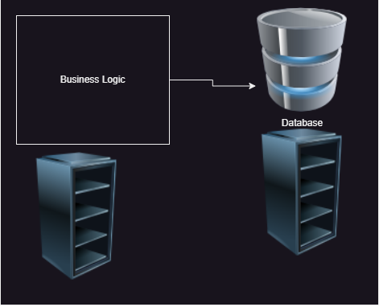
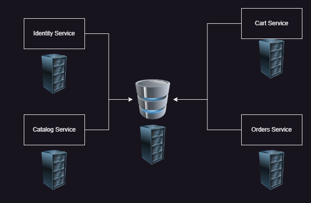
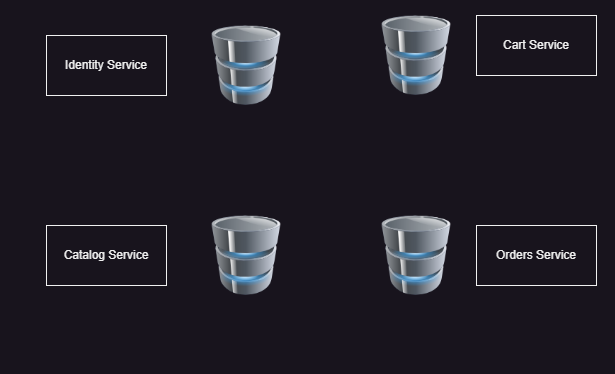

## Advanced Docker:
# Monolith
* In this category application is developed
     * to run on a single server
     * in single code base
     * in single technology
* Architecture:

* Problems
     * Deployment:
         * To make the smallest possible change on business logic server, we need to take the application down and then deploy
* Advantages:
   * Simple to configure
   * Simple to deploy
* Distributed Monolith
   * Application is broken into       individually runnable services which share the common database   

## MicroServices
   * Application is broken down into smaller individually deployable services with each service having its own database/datastore
 
* Generally domain/problem based decomposition is popular phenomnenon.
* Eventual consistency is important term
* Advantages:
    * Scaling: Individually scale the microservices
    * Technology Changes: each service can be implemented in technology suitable for it.
* Disadvantages:
    * Orchestration:
    * Distributed system challanges
* Containers
   * What are solaris zones & when were they introduced?
   * When was linux namespaces & containers introduced?
   * We will figure out this technology tomorrow.
